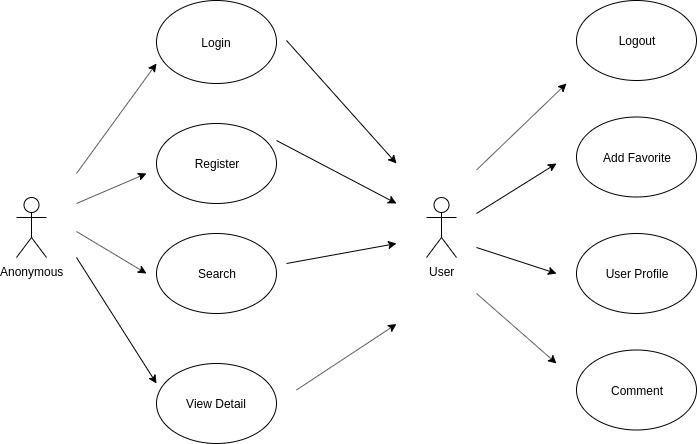
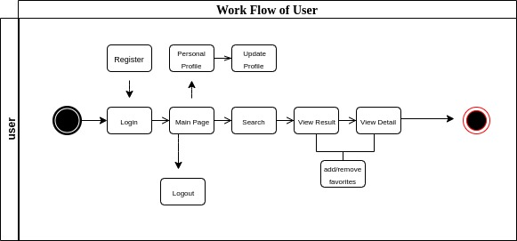

# SKY ODYSSEY

## Introduction

Sky Odyssey is a web application that uses SpaceX API to get information about past launches of the company.

### Features

- Register users
- Sign in, sign out
- Search launches by year
- Click favourites when logged in
- Get detail information about one launch

 

 

## Functional Description

### User Cases

### Flow

## Technical Description

### Components

### Data Model

### Screenshots

